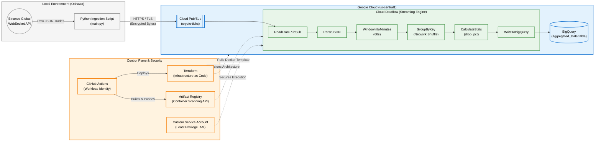

# 📉 Flash Crash Detector (Real-Time Stream Processing)


A real-time data engineering pipeline designed to detect "Flash Crash" anomalies in stock market data. This project leverages **Google Cloud Platform (GCP)** serverless technologies to ingest, process, and analyze financial data streams with sub-minute latency.

## 🏗️ Logical Architecture

This system uses a **Poller Pattern** for ingestion and a **Streaming Pipeline** for processing.



## 🧩 System Components

### 1. The Ingestion Layer (`/src/ingestion`)
* **Service:** Cloud Functions (Gen 2) triggered by Cloud Scheduler.
* **Role:** Fetches real-time stock quotes from the **Alpha Vantage API** every 60 seconds and publishes the payload to a Pub/Sub topic.
* **Key Tech:** Python 3.11, `requests`, Google Pub/Sub Client.

### 2. The Processing Layer (`/src/pipeline`)
* **Service:** Cloud Dataflow (Apache Beam).
* **Role:** Subscribes to the data stream, groups data into fixed 1-minute windows, and calculates the percentage drop from the window's opening price to the current price.
* **Logic:** If a drop exceeds the defined threshold (e.g., 5%), the event is flagged as a "Crash" and routed to a high-priority BigQuery table.

## 🛠️ Local Development Setup

### Prerequisites
* **Python 3.11** (Required for Apache Beam compatibility)
* **Google Cloud SDK**
* Alpha Vantage API Key

### Installation

1.  **Clone the repository:**
    ```bash
    git clone [https://github.com/michaelpineau89-ship-it/flash_crash_detector.git](https://github.com/michaelpineau89-ship-it/flash_crash_detector.git)
    cd flash_crash_detector
    ```

2.  **Create a Virtual Environment:**
    *Note: Ensure you use Python 3.11 to avoid build errors with Apache Beam.*
    ```bash
    python3.11 -m venv env
    source env/bin/activate
    ```

3.  **Install Dependencies:**
    ```bash
    pip install -r requirements.txt
    ```

### Running the Connectivity Test
Verify that your environment can reach the external stock API.
```bash
python3 src/verify_connectivity.py --api_key="YOUR_API_KEY"
```

