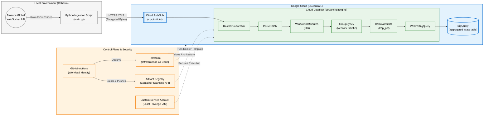

# High-Frequency Crypto Ingestion & Analytics Pipeline

An enterprise-grade streaming data pipeline designed to process high-frequency cryptocurrency trades (BTC/USDT) with sub-second latency. This project demonstrates modern, cloud-native streaming patterns, infrastructure-as-code (IaC), and strict DevSecOps integrations.

## 🏗 Architecture Blueprint

This system uses a **Poller Pattern** for ingestion and a **Streaming Pipeline** for processing.

## 🚀 Project Overview

This architecture captures live WebSocket ticks from the Binance global exchange, securely queues them in Google Cloud Pub/Sub, and leverages Apache Beam (Cloud Dataflow) to aggregate the raw data into 1-minute tumbling windows. The aggregated statistics—including volume, price action, and automated flash-crash detection—are continuously streamed into BigQuery for downstream analytics.

## 🛠 Core Technologies

* **Ingestion:** Python, `websocket-client`, Google Cloud Pub/Sub
* **Stream Processing:** Apache Beam, Google Cloud Dataflow (Streaming Engine)
* **Data Warehousing:** Google BigQuery
* **Infrastructure as Code (IaC):** Terraform
* **CI/CD & Security:** GitHub Actions, Workload Identity Federation (WIF), Artifact Registry (Container Scanning API)

## 🧠 Engineering Challenges Solved

Building a resilient streaming pipeline requires navigating complex distributed systems architectures. Key solutions implemented in this project include:

* **Stateful Edge Ingestion:** Bypassed the ephemeral, stateless nature of serverless containers (which aggressively throttle CPU and drop long-running WebSockets) by deploying a dedicated, persistent Python ingestion worker that handles automated reconnects and 451 geo-block routing.
* **Distributed Serialization Barriers:** Overcame Apache Beam's complex distributed memory model by implementing dynamic "inner imports" and `save_main_session` configurations, ensuring isolated Dataflow worker VMs could successfully hydrate and execute Python dependencies across the network.
* **Liquid Sharding & Firewall Optimization:** Eliminated the need to open internal TCP ports (`12345-12346`) on the VPC by enabling Dataflow Streaming Engine, offloading the heavy `GroupByKey` network shuffle to Google's managed backend while unlocking infinite worker scaling.

## 🔒 Security & Cost Optimization (Production Tiering)

While this repository demonstrates a highly scalable Proof-of-Concept, it is built with production-grade security and cost controls in mind:

* **Least Privilege IAM:** The Dataflow workers do not run as project editors. They operate under a strictly scoped custom Service Account with precise bindings (`dataflow.worker`, `pubsub.subscriber`, `bigquery.dataEditor`).
* **Automated Vulnerability Scanning:** Artifact Registry is configured with the Container Scanning API to automatically cross-reference new Docker pushes against global CVE databases before deployment.
* **Stateless Key Management:** Zero static JSON service account keys are stored or used. GitHub Actions securely authenticates to Google Cloud via OpenID Connect (OIDC) and Workload Identity Federation.
* **Cost Engineering:** The architecture can be adapted to utilize Preemptible/Spot VMs for the ingestion layer and BigQuery micro-batching to drastically reduce streaming insert costs without sacrificing data integrity.

---
**Architected by Mike** *Google Certified Data Engineer | 10+ Years IT Industry Experience* **Freelance Data Solutions**